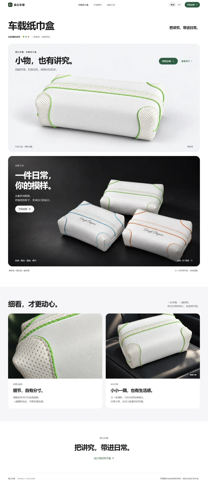
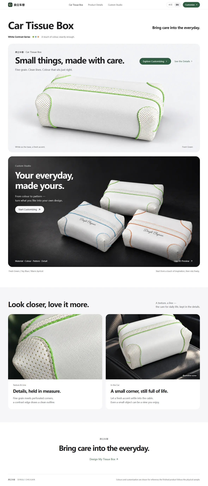
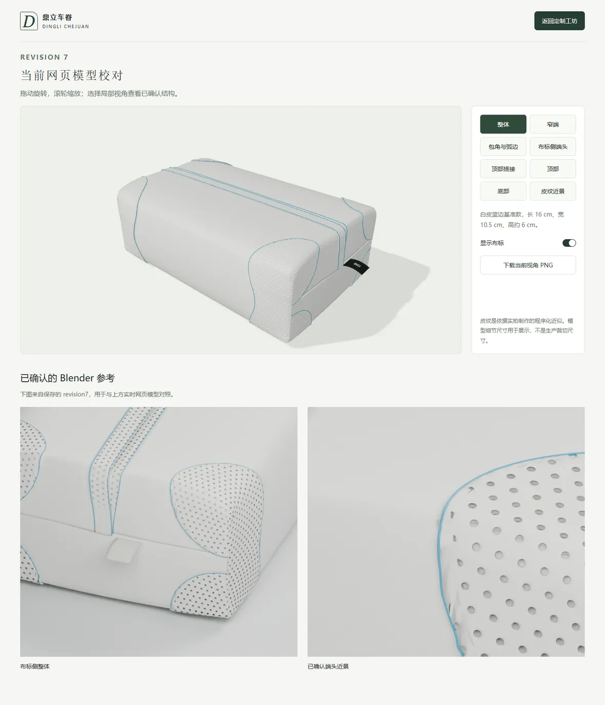
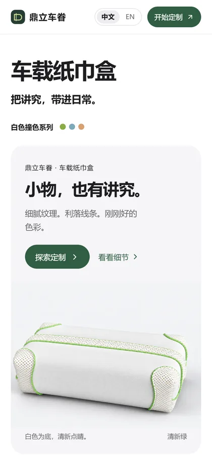
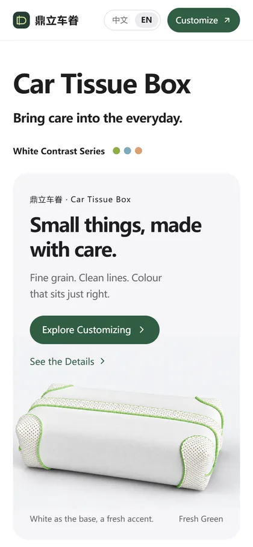
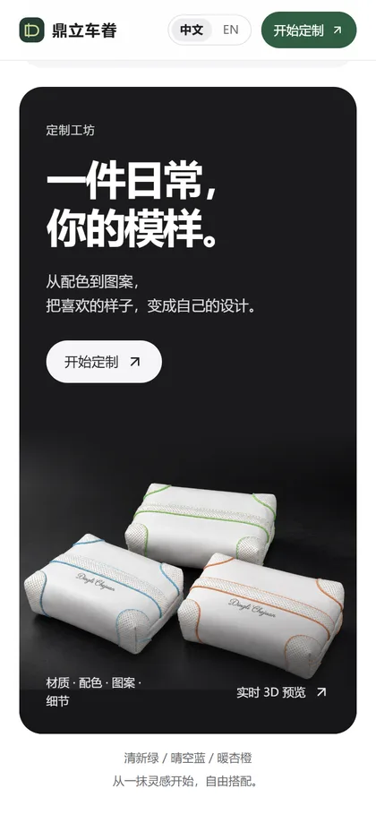
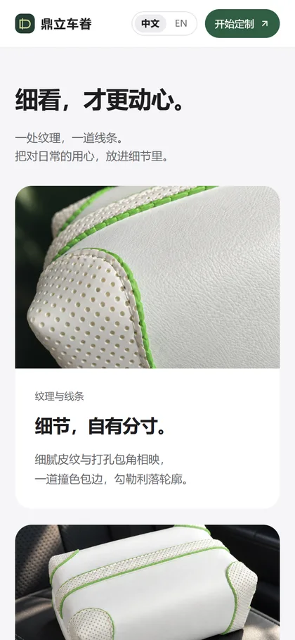
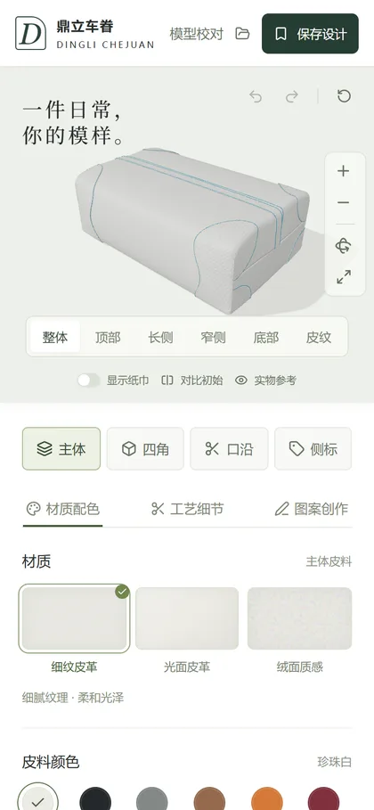
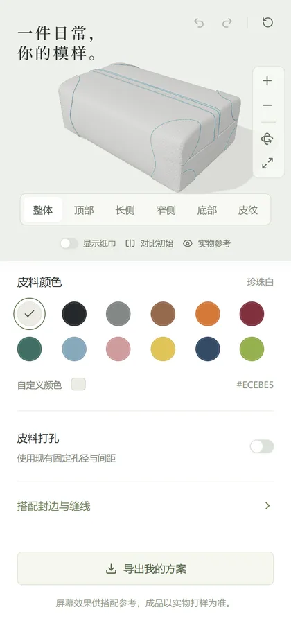
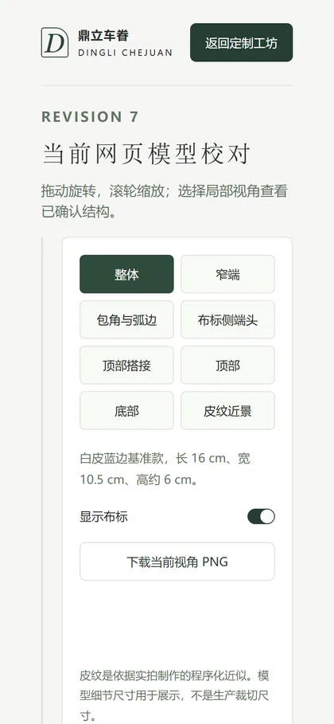

# 鼎立车眷 (DINGLI CHEJUAN) — Car Tissue Box Website

A brand website for a leather car tissue box, with a 3D customizer where a customer picks the material, colour, perforation and artwork for each part.

**This is an early demo of a product website I'm experimenting with for a leather car tissue box, featuring an interactive 3D customization experience. Every page is shown below on desktop and mobile, so nothing needs to be installed or run.

Chinese notes: [README.zh.md](README.zh.md)

---

## Desktop

### Home — Chinese



### Home — English

The site has a Chinese / English switch in the header. The choice lives in the URL, so the English page is directly shareable.



### Customization studio


### Model review

An internal page used to check the web model against the Blender reference renders.



---

## Mobile

| Home · Chinese | Home · English | Home · customization poster |
| --- | --- | --- |
|  |  |  |

| Home · detail cards | Studio · 3D stage | Studio · editing panel |
| --- | --- | --- |
|  |  |  |



---

## Design notes

Written down so the intent is clear and can be judged against the result.

- **Palette** — near-black ink `#1d1d1f` on white, a warm neutral `#f5f5f7` for the soft sections, and one deep green `#315d43` used only for actions. The product's own colours (green, sky blue, warm apricot) are left to carry the colour.
- **Type** — system sans throughout, tight negative tracking on display sizes, small letterspaced eyebrows above the headings for an editorial feel.
- **Layout** — 1440 px max width, 30 px radius on the large cards, a two-column detail grid, generous section padding.
- **Art direction** — studio-lit product photography on light grey. The customization poster is the single dark, high-contrast moment on the page, and the whole poster is one clickable target.
- **Language switch** — a quiet outlined pill sitting next to the primary button. Deliberately subordinate: visible at a glance, but it must not compete with "Start Customizing".
- **Mobile** — the desktop composition is not simply stacked; the hero, poster and detail cards each get their own mobile arrangement and image cropping.


## Running it (optional)

Nothing above needs this — the screenshots cover the visual review.

```bash
npm install
npm run dev      # http://localhost:5173
```

Node.js 22.13+.
