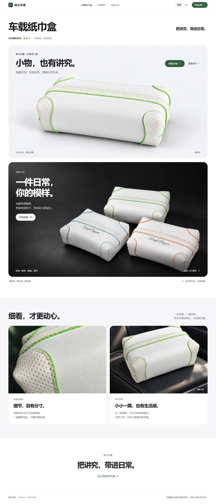
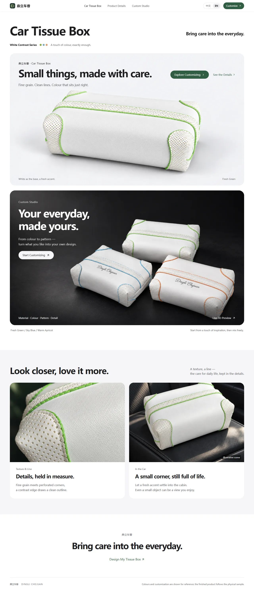
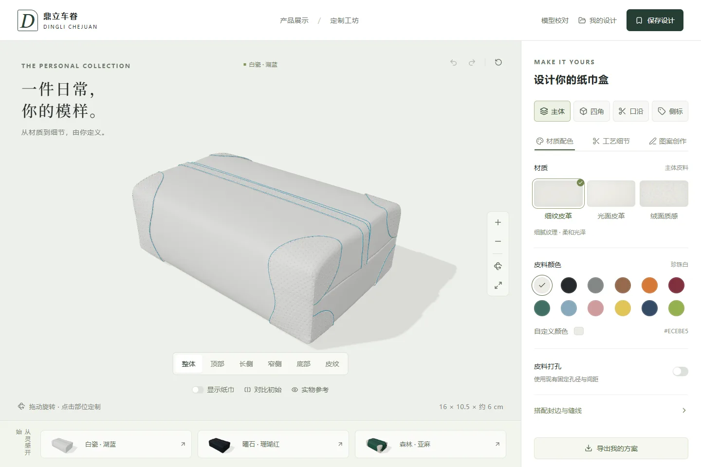
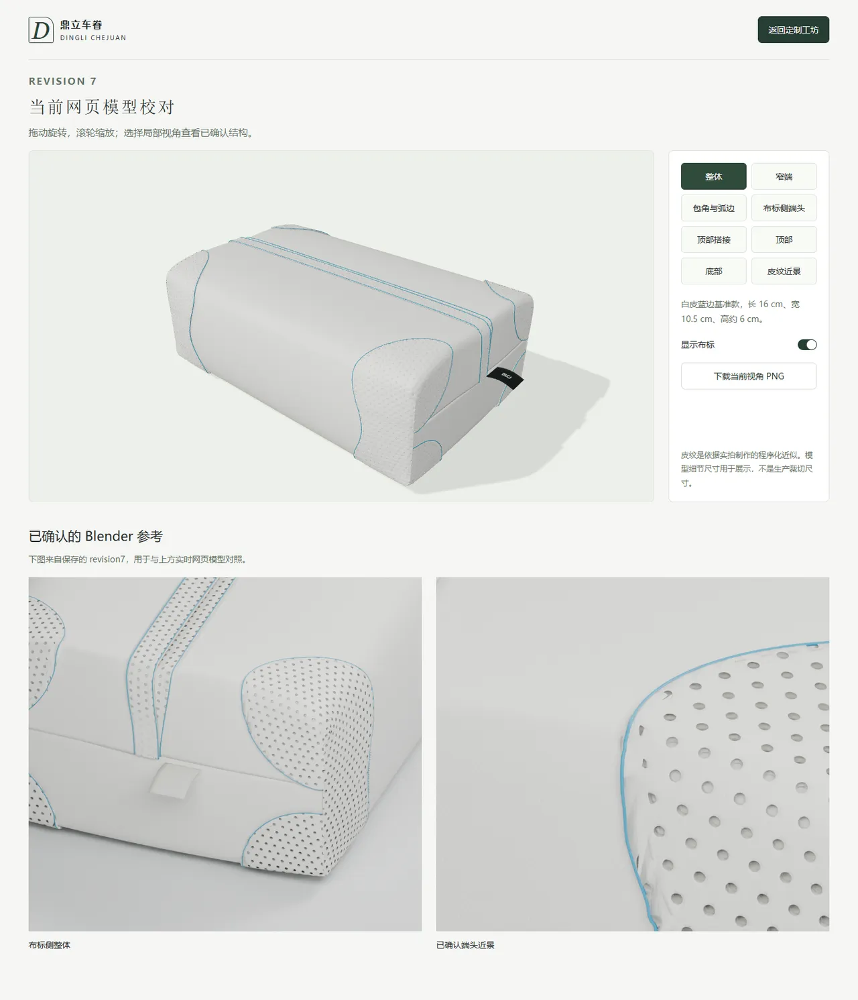
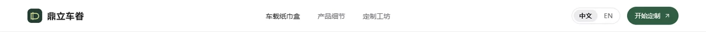

# 鼎立车眷 (DINGLI CHEJUAN) — Car Tissue Box Configurator

A brand showcase site plus a real-time 3D customizer for a leather car tissue box. The model was rebuilt in Blender from the original flat leather pattern, so the body, the four corner wraps and the trim can each be re-materialed, re-coloured, perforated and printed with custom artwork, with edge paint, stitching and a narrow side label as separate controls.

Chinese notes and the full validation log: [README.zh.md](README.zh.md)

## Screenshots

Taken from the running build. No setup needed to look at these.

| Home · Chinese | Home · English |
| --- | --- |
|  |  |

| Customization studio | Model review |
| --- | --- |
|  |  |

The language switch sits in the home page header. The choice lives in the URL (`/?lang=en`) and switching is a plain link, so it works without JavaScript and the English page is shareable:



## Pages

| Route | What it is |
| --- | --- |
| `/` | Brand showcase. Server-rendered, art-directed WebP, no 3D loaded on this route. |
| `/customize` | The 3D studio. Drag to orbit, click a part to edit it. |
| `/model-review` | Checks the web model against the saved Blender reference renders. |
| `/api/designs` | Reads and writes saved designs. Requires sign-in, stores per user in R2. |

## What it does

- **Parts** — body, four corner wraps (linked by default, separable), trim, side label.
- **Per part** — material (grained / smooth / suede), colour, edge paint colour, thread colour, perforation on/off, artwork.
- **Artwork** — image upload (PNG/JPG/WebP), text, brush, eraser, layer removal. Drawn on the unfolded leather piece and folded back onto the model live.
- **Perforation** — fixed 0.86 mm holes on a 2.4 mm × 2.1 mm pitch, evaluated in the shader from the saved tangent metric instead of being baked into geometry.
- **Draft and export** — drafts autosave to IndexedDB and survive a reload; export a multi-view PNG sheet or a JSON file that keeps the original artwork bitmaps and brush strokes.

## Run it locally

Node.js 22.13+. Roughly 500 MB of dependencies.

```bash
npm install
npm run dev      # http://localhost:5173
```

`npm run build` produces the Cloudflare Worker bundle, `npx tsc --noEmit` type-checks.

The web model is ~18 MB, so the first visit to `/customize` waits on it. Saving a design and "My designs" need sign-in; without it the UI says so and drafts still persist in the browser.

## Structure

| Path | Contents |
| --- | --- |
| `app/page.tsx` | Showcase home page — server component, no 3D |
| `lib/showcase-copy.ts` | Home page copy, Chinese and English |
| `app/showcase.css` | Showcase styles, `sc-` prefixed and isolated from the studio |
| `components/studio.tsx` | Studio UI and state |
| `components/product-view.tsx` | Three.js scene, camera presets, materials, export |
| `lib/perforation.ts` | Web-equivalent perforation shader |
| `components/model-review.tsx` | Model review page |
| `app/api/designs/route.ts` | Saved-design read/write against R2 |
| `public/models/revision7/` | Web GLB and its manifest |

## Model notes

- Folded in Blender from a single notched leather piece; the four corner wraps are separate connected meshes. Three independent UV sets for artwork, grain and perforation holes.
- 38 product objects, 765,740 triangles. No rebuild, no decimation, no vertex quantization. Lossless Meshopt compression to ~18.2 MB, byte-identical after decode.
- Grain is a 2048 normal/roughness map on a 40 mm physical period; hole size and pitch use a fixed display scale.
- Baseline size is 16 × 10.5 × ~6 cm. Overlap depth, thickness and micro-texture are still fitted from photos.

## Known limitations

Being blunt about these, since the point of publishing is to get outside eyes on it.

- **Not deployed.** Local only. Sign-in and remote R2 storage have not been exercised against a live environment.
- **The model is not production-calibrated.** Real measurements, paper patterns, a physical colour card and label sizes still need to be taken before any cutting file can be produced, and the web export is not a cutting file.
- **~26 MB first load** on `/customize` (18 MB GLB + 7 MB normal map + 1.4 MB roughness map), with a static loading line and no progress indicator.
- **The "grain" camera preset is weak.** It zooms in far enough that the grain is hard to read and the model overlaps the stage heading. The model review page shows the same texture correctly, so this is camera and lighting rather than a texture problem.
- Verified on desktop (1366×768, 1440×960) and for mobile layout, but touch 3D interaction and low-end device performance are untested.
- The repo is currently all local commits on `main`; nothing has been published.
