# 鼎立车眷 (DINGLI CHEJUAN) — Brand & Product Website

A brand website with separate floor-mat and car tissue-box collections. The tissue-box studio lets a customer pick the material, colour, perforation and artwork for each part.

This is an early demo of a product website I'm experimenting with for a leather car tissue box, featuring an interactive 3D customization experience. Every page is shown below on desktop and mobile, so nothing needs to be installed or run.

Chinese notes: [README.zh.md](README.zh.md)

## Brand home and floor mats · 2026-10-01

- `/` is the mother-brand homepage, with independent product entries that can grow with future collections.
- `/mats` is a display-only floor-mat collection: nine large photos, side arrows, six-second autoplay, pause/play, keyboard controls and mobile swiping. Manual selection pauses autoplay; reduced-motion settings are respected.
- The existing tissue-box storefront has moved to `/tissue-box`. Its Chinese/English switch stays within that collection; `/customize` and the design APIs keep their existing routes.
- New content, styles and assets are separate from the tissue-box design data and backend. The shared-file merge notes and image provenance are in [the integration notes](docs/品牌首页与脚垫模块.md).

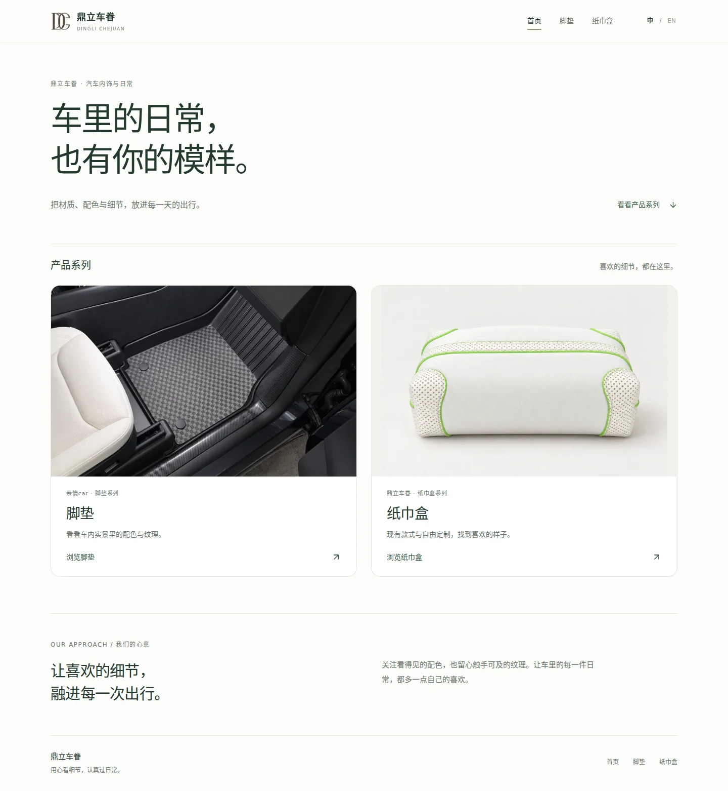

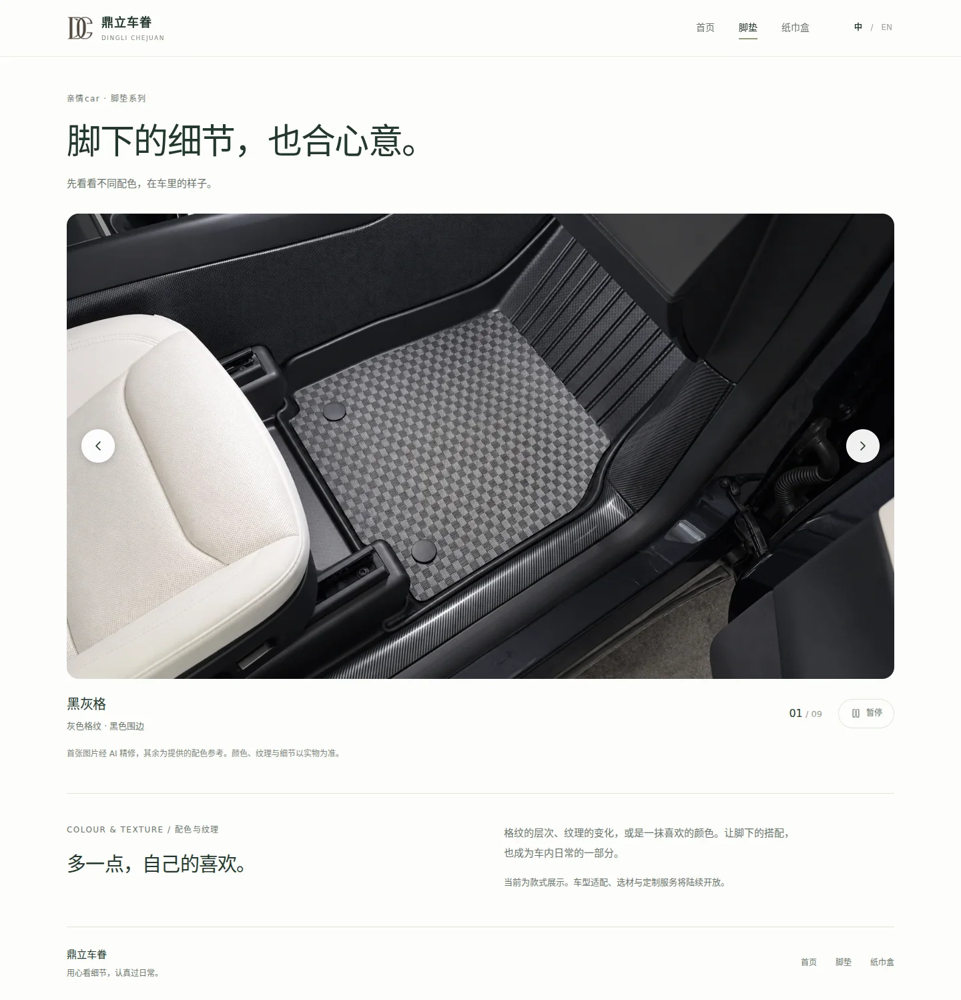

## Current storefront · 2026-09-30

- Seven existing styles are **CNY 99 per piece**, including Diamond Perforation. Side arrows switch the main photo; the full style list opens only when needed.
- Custom colour and detail combinations are **CNY 159 per piece**. Personal artwork, embroidery and other special work are quoted privately.
- Style enquiries retain the selected name and price. Customers can copy their request and contact the maker directly.
- Four new product photos use a consistent camera angle, light background and soft studio lighting. The website serves responsive WebP images.
- The 3D studio uses the approved revision9 model, with the existing local drafts, artwork editor and plan exports.

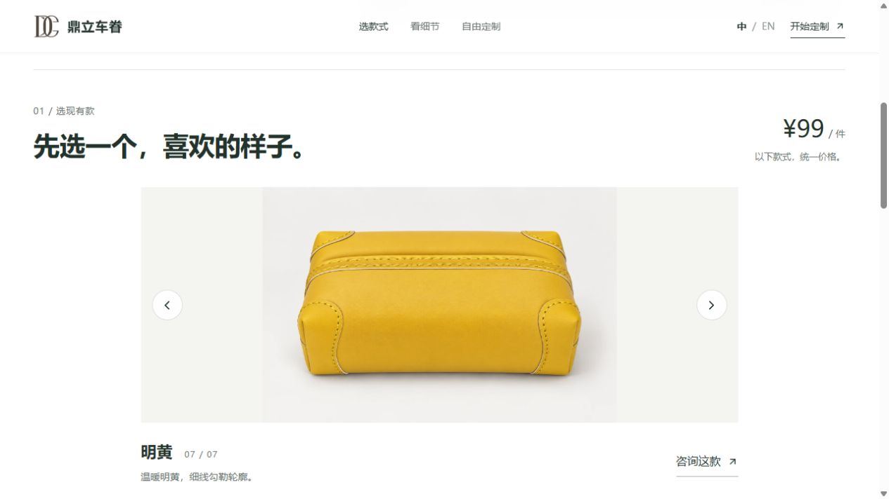

TypeScript checks and the production build passed. Desktop and mobile checks covered style switching, enquiries and the pricing notes. The screenshots below record the earlier design.

---

## Earlier screenshots · Desktop

### Home — Chinese

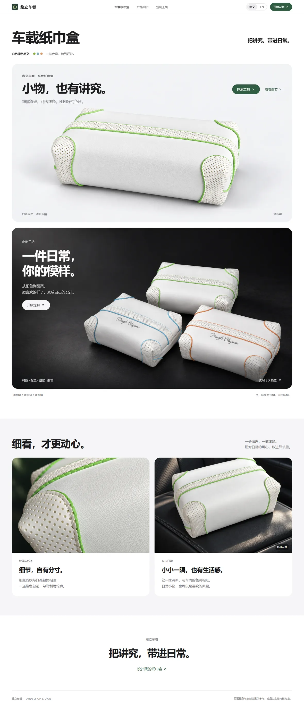

### Home — English

The site has a Chinese / English switch in the header. The choice lives in the URL, so the English page is directly shareable.

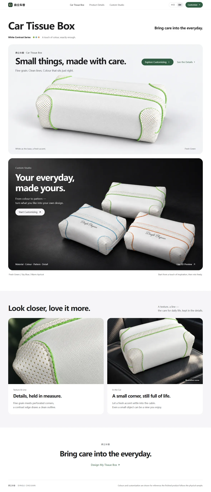

### Customization studio

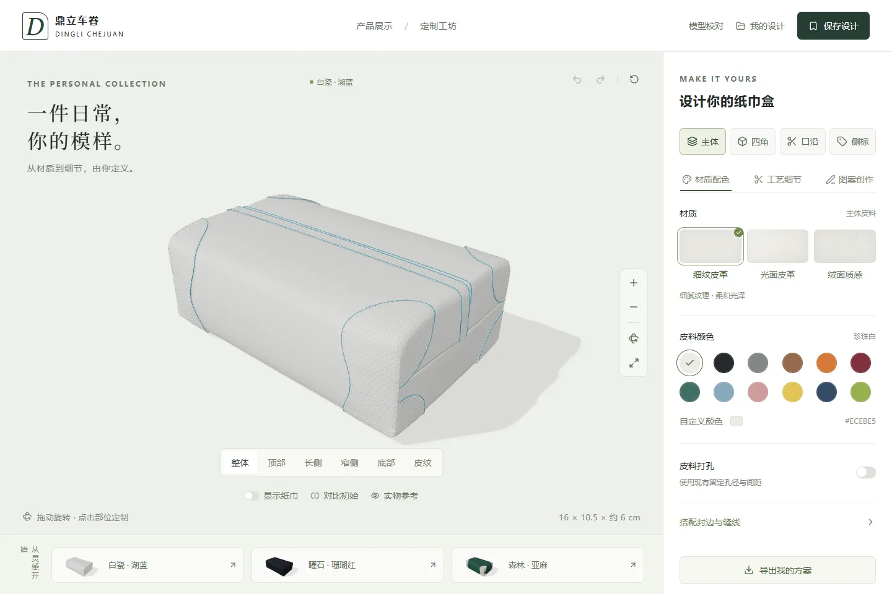

### Model review

An internal page used to check the web model against the Blender reference renders.

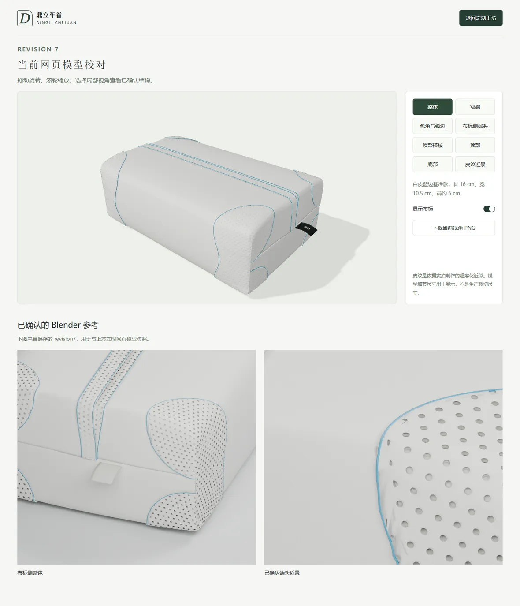

---

## Earlier screenshots · Mobile

| Home · Chinese | Home · English | Home · customization poster |
| --- | --- | --- |
| 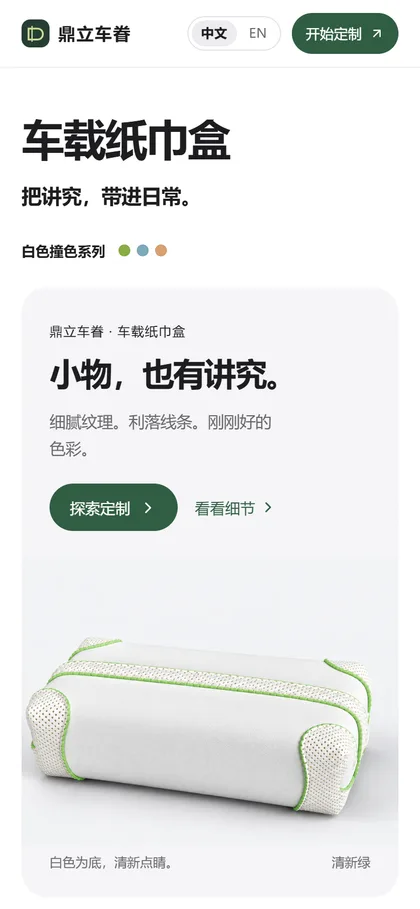 | 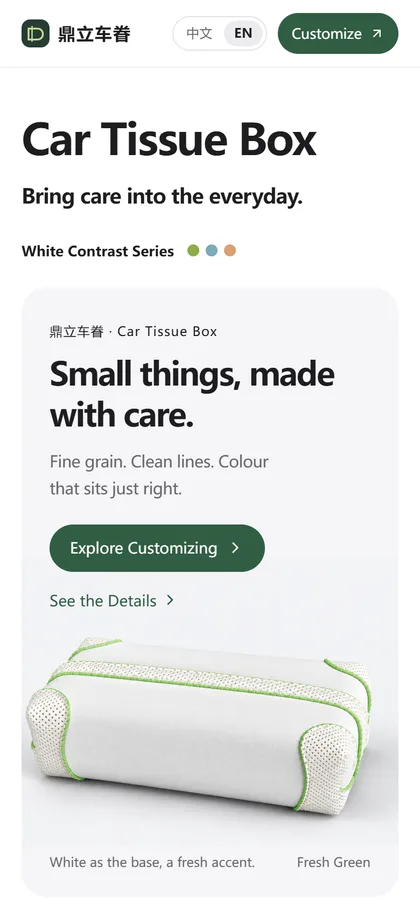 | 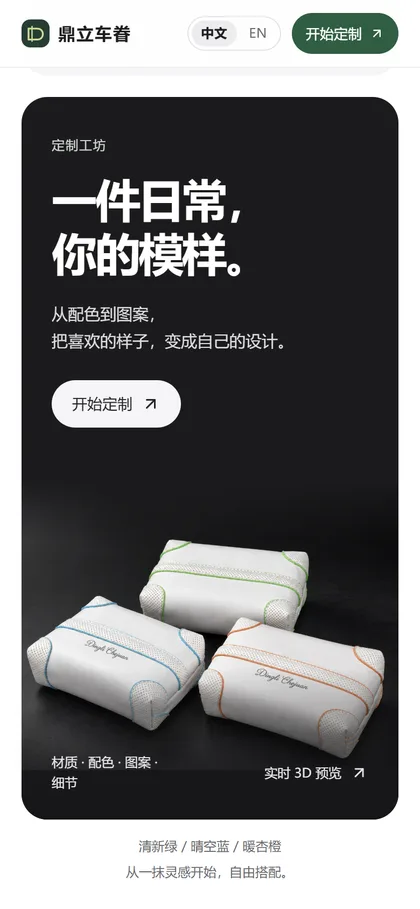 |

| Home · detail cards | Studio · 3D stage | Studio · editing panel |
| --- | --- | --- |
| 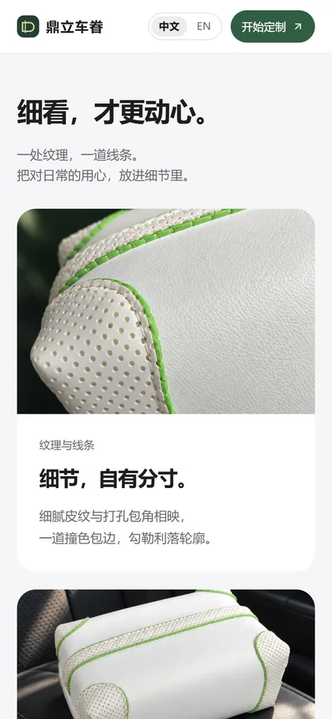 | 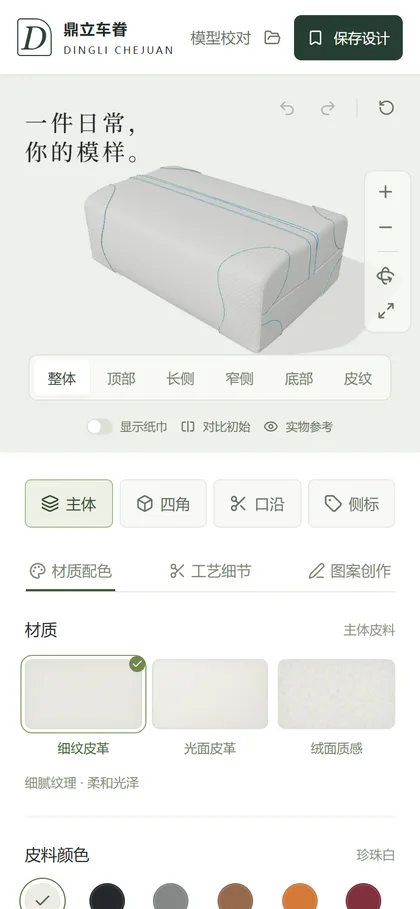 | 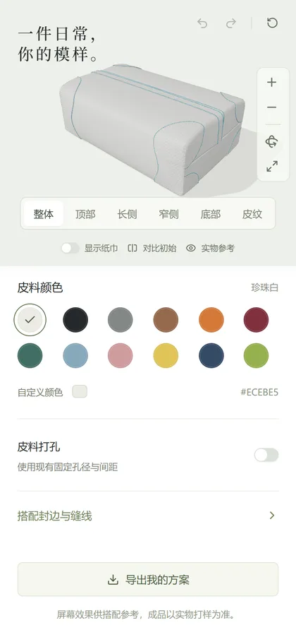 |

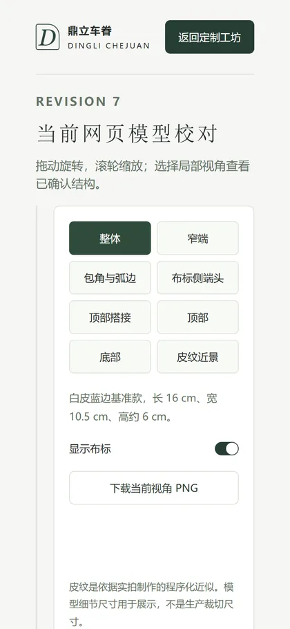

---

## Earlier design notes

Written down so the intent is clear and can be judged against the result.

- **Palette** — near-black ink `#1d1d1f` on white, a warm neutral `#f5f5f7` for the soft sections, and one deep green `#315d43` used only for actions. The product's own colours (green, sky blue, warm apricot) are left to carry the colour.
- **Type** — system sans throughout, tight negative tracking on display sizes, small letterspaced eyebrows above the headings for an editorial feel.
- **Layout** — 1440 px max width, 30 px radius on the large cards, a two-column detail grid, generous section padding.
- **Art direction** — studio-lit product photography on light grey. The customization poster is the single dark, high-contrast moment on the page, and the whole poster is one clickable target.
- **Language switch** — a quiet outlined pill sitting next to the primary button. Deliberately subordinate: visible at a glance, but it must not compete with "Start Customizing".
- **Mobile** — the desktop composition is not simply stacked; the hero, poster and detail cards each get their own mobile arrangement and image cropping.

## Running it (optional)

Nothing above needs this — the screenshots cover the visual review.

```bash
npm install
npm run dev      # http://localhost:5173
```

Node.js 22.13+.
