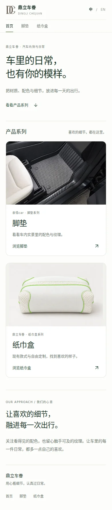
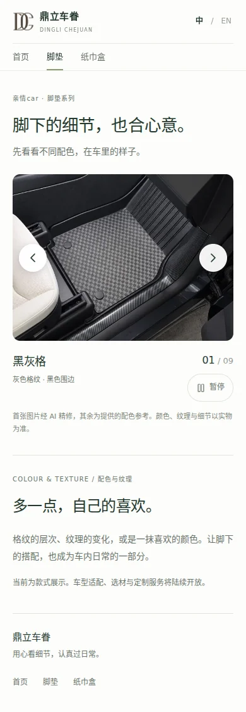

# 品牌首页与脚垫展示模块

本阶段将鼎立车眷作为母品牌首页，脚垫、纸巾盒作为并列产品系列。首页文案适用于继续增加新品；脚垫先展示现有配色参考，销售服务准备好后再扩展。

## 页面与入口

| 路径 | 本阶段内容 | 与原功能的关系 |
| --- | --- | --- |
| `/` | 母品牌首页、脚垫和纸巾盒的大图入口 | 原纸巾盒首页迁移到独立栏目 |
| `/mats` | 亲情car脚垫，九张大图轮播与配色说明 | 独立新增，不调用设计或订单 API |
| `/tissue-box` | 原纸巾盒现有款式、定制入口、咨询说明 | 保留原展示内容、价格和组件 |
| `/customize` | 原纸巾盒 3D 定制工坊 | 路径不变；返回展示前的草稿保存逻辑保留 |
| `/api/designs` | 原纸巾盒方案接口 | 数据结构、用户隔离与存储逻辑不变 |

新首页与脚垫页也支持 `?lang=en`。纸巾盒的语言切换改为 `/tissue-box` 与 `/tissue-box?lang=en`，品牌标识返回母品牌首页。

## 脚垫展示规则

- 一次展示一张大图，左右两侧放切换箭头，无小图列表。配色名称与序号放在图片下方。
- 默认每六秒切换一张；箭头、方向键或滑动选款后暂停，用户可点“播放”继续。
- 悬停、焦点进入、页面切到后台或轮播离开视口时暂停。系统设置减少动态效果时不自动播放，仍可主动点击播放。
- 手机支持横向滑动，同时保留页面纵向滚动与缩放。箭头触摸区域至少 44 像素。
- 图片使用 800/1536 像素的 WebP，初始仅显示首张、预加载下一张，不一次下载九张大图。
- 展示名沿用提供图片的标注，不将“碳纤丝”等名字当作已核实的材料成分。当前不承诺适配车型、价格、库存或交付时间。

## 文件边界与以后共用后台

| 文件 | 用途 |
| --- | --- |
| `lib/product-lines.ts` | 首页产品入口；增加未来系列时继续添加配置 |
| `components/brand/`、`app/brand.css`、`lib/brand-copy.ts` | 新首页与新增产品页共用的品牌框架 |
| `app/mats/`、`components/floor-mats/`、`lib/floor-mats/` | 脚垫页面、轮播与展示内容 |
| `public/floor-mats/` | 脚垫专用图片 |
| `app/tissue-box/page.tsx` | 从原首页迁入的纸巾盒展示页 |

本次没有新增第二套后台，也没有把脚垫内容放进纸巾盒的 `Design`、本机草稿或 `/api/designs`。以后可以继续使用同一后台管理产品系列，在真实 SKU、版型与服务规则确认后增加脚垫的管理数据。

## 同步开发时的合并位置

本分支从主分支 `4b77d769020851bcff7a2d918da15e2d2c0e9a0f` 创建。纸巾盒和后台继续开发时，合并重点是以下位置：

1. `app/page.tsx` 现在是母品牌首页。其他分支对原纸巾盒首页的最新修改，应带入 `app/tissue-box/page.tsx`，避免直接用旧首页覆盖新首页。
2. `app/layout.tsx` 仅更新默认品牌标题与介绍，保留原图标和全局样式。
3. `components/studio.tsx` 仅调整两个返回链接、返回地址与文字；保留最新工坊功能和保存草稿逻辑。
4. `README.md` 与 `README.zh.md` 补充栏目说明。纸巾盒组件、价格、后端接口、数据库、依赖与锁文件均未修改。

## 图片来源

来自用户提供的 `1001临时目录`。首张黑灰格使用已经确认方向的 AI 精修版本，调整光线与清晰度并移除原图片文字；保持原脚垫外形、格纹与固定扣。其余使用提供的配色参考原图，仅作网页尺寸与格式转换。页面已注明首张 AI 精修及实物确认说明。

| 展示名 | 原图片文件 | 网页资源前缀 |
| --- | --- | --- |
| 黑灰格 | `mmexport1790842782082.jpg` | `black-gray-grid` |
| 黑棕格 | `mmexport1790842777163.jpg` | `black-brown-grid` |
| 理想橙碳纤丝 | `mmexport1790842774534.jpg` | `orange-texture` |
| 黑银格 | `mmexport1790842778380.jpg` | `black-silver-grid` |
| 咖桔格 | `mmexport1790842772901.jpg` | `coffee-orange-grid` |
| 黑银碳纤丝 | `mmexport1790842776024.jpg` | `black-silver-texture` |
| 黑酒红格 | `mmexport1790842780907.jpg` | `black-wine-grid` |
| 黑桐碳纤丝 | `mmexport1790842780065.jpg` | `black-tong-texture` |
| 黑灰碳纤丝 | `mmexport1790842783415.jpg` | `black-gray-texture` |

本阶段未使用材料样本或底托全套照片来推断品牌、车型和整套包含件数。

## 本地验证 · 2026-10-01

- `npm run build`、`npx tsc --noEmit` 通过；新增页面、组件、内容配置和 QA 脚本的 ESLint 检查为零错误、零警告。
- 仓库整体 `npm run lint` 仍有 15 个既有错误，集中在原编辑器、3D 组件和草稿 hook。对照基础提交的相关源码，本次未增加错误；没有为通过检查改动这些既有功能。
- 浏览器验证了六秒轮播、手动暂停、主动恢复、首尾循环、方向键、九张图片加载、减少动态效果设置和手机原生滑动。
- 320、390、820、1440 像素宽度下，首页、脚垫、纸巾盒的中英文页面均无横向溢出。脚垫初始仅请求首张和下一张图片，不加载 3D 模型或方案接口。
- 原纸巾盒选款、99元咨询价格、英文入口、revision9 模型加载均通过；工坊返回 `/tissue-box` 前可保存草稿，再次进入可恢复。
- `node docs/qa/purchase-flow-check.mjs` 的既有咨询测试通过；方案 schema、用户隔离与本地 R2 保存/读取测试通过。
- 本轮仅验证本地运行环境，没有修改或测试生产环境的用户、订单和存储数据。

浏览器检查脚本：`docs/qa/brand-floor-mats-check.mjs`。它在同一进程环境启动临时开发服务，使用已安装的 Playwright；可通过 `PLAYWRIGHT_MODULE` 和 `CHROMIUM_EXECUTABLE_PATH` 指定已有测试运行时。检查结果与未压缩截图写到忽略提交的 `checks/brand-floor-mats/`。

## 实际页面截图

| 手机首页 | 手机脚垫栏目 |
| --- | --- |
|  |  |
